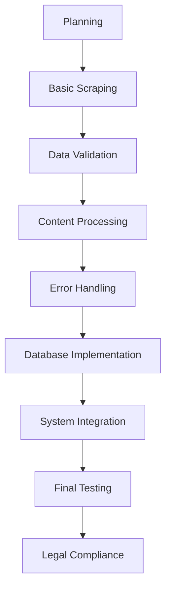

# Program: scrape_the_law_mk3
**Version: 0.1.1** 
**Authors: Kyle Rose, Claude 3.5 Sonnet, Codestral**

# Table of Contents

1. Problem Definition
   - 1.1 Problem Statement
   - 1.2 Objective
   - 1.3 Global Success Metrics
   - 1.4 Success Metrics by Stakeholder Type
      - 1.4.1 Legal/Government Stakeholders
      - 1.4.2 Business/Industry Stakeholders
      - 1.4.3 Research/Academic Stakeholders
      - 1.4.4 Public Interest/Advocacy Stakeholders
      - 1.4.5 Technical Stakeholders
2. Success Criteria
   - 2.1 Minimum Viable Product (MVP)
   - 2.2 MVP Timeline
3. Scope Definition
   - 3.1 In Scope
   - 3.2 Explicitly Out of Scope
4. Risk Assessment
   - 4.1 Technical Risks
   - 4.2 Legal Risks
   - 4.3 Resource Risks
5. Requirements Matrix: MVP
6. Constraints
   - 6.1 Business Constraints
      - 6.1.1 Budget Limits
      - 6.1.2 Timeline Restrictions
      - 6.1.3 Resource Availability
      - 6.1.4 Regulatory Requirements
      - 6.1.5 Stakeholder Expectations
      - 6.1.6 Scalability Constraints
      - 6.1.7 Maintenance and Support
      - 6.1.8 Licensing and Partnerships
7. Implementation Phases
   - 7.1 Phase 0: Planning & Setup
   - 7.2 Phase 1: Core Scraping
   - 7.3 Phase 2: Data Processing
   - 7.4 Phase 3: Storage & Integration
   - 7.5 Phase 4: MVP Completion

## NOTE: Termonology Shorthand
For the sake of brevity, the following shorthand will be used where it does not fundamentally change the intent or meaning of the text.
| Termonology                        | Shorthand                  |
|------------------------------------|----------------------------|
| 'incorporated places and counties' | 'cities'.                  |
| 'legal text', 'legal document'     | 'law'/'laws'               |
| 'documents'                        | 'docs' when not in header. |
| 'gigabytes'                        | 'GB'                       |
| 'large language model'             | 'LLM'                      |
| 'number'                           | '#'                        |
| 'specifications'                   | 'specs' when not in header |
| 'information'                      | 'info' when not in header  |
| 'requirements'                     | 'reqs' when not in header  |
| 'repository'                       | 'repo'                     |

# 1. Problem Definition

## 1.1 Problem Statement
Per the US Library of Congress, there currently does not exist a single repository for all US municipal codes.¹ This reduces government transparency, increases the cost of legal compliance, and prevents the automation of legal research.
- 1: See: https://guides.loc.gov/municipal-codes/current-municipal-codes, accessed 11/24/2024

## 1.2 Objective
Build a web scraping system to collect municipal legal codes from US cities/counties and store them in a structured database. The system will:
- Extract laws from official government or government-contracted websites and databases.
- Parse and standardize raw content into tabular data with metadata
- Store in a database with proper relationships and versioning
- Maintain version history and track code updates/amendments
- Handle different website structures and content formats

### 1.3 Global Success Metrics, ordered by priority
| Category     | Metric                        | Minimum Target  | Optimal Target  | Measurement Method                                           |
|--------------|-------------------------------|-----------------|-----------------|--------------------------------------------------------------|
| Coverage     | % of US cities covered        | 50%             | 95%             | Codes available / Total # cities                             |
| Accuracy     | Text accuracy vs. source      | 99%             | 99.99%          | Error rate per 1000 words                                    |
| Completeness | Code section coverage         | 95%             | 99.99%          | Code Sections Available / Total # Code Sections              |
| Transparency | Source attribution available  | 100%            | 100%            | Content with Metadata / Total Content                        |
| Reliability  | Error rate in data processing | < 1%            | < 0.1%          | Error rate per 1000 content chunks                           |
| Consistency  | Format standardization        | 95%             | 99.99%          | Random sample of content chunks vs pre-defined standard      |
| Scalability  | Data growth handling          | +200GB per year | +500GB per year | System performance monitoring                                |
| Freshness    | Update lag time               | < 30 days       | < 7 days        | Update timestamp vs rate of change of versions               |
| Availability | System uptime                 | 99%             | 99.99%          | Time available over a rolling 30-day period                  |
| Performance  | Average query response time   | < 2s            | < 200ms         | API response timing                                          |

## 1.4 Success Metrics by Stakeholder Type

### 1.4.1 Legal/Government Stakeholders
| Stakeholder | Primary Needs | Metric | Target | Measurement Method |
|-------------|--------------|---------|---------|-------------------|
| Lawyers | - Fast access to relevant codes - Accuracy of legal text - Version history | - Search response time - Text accuracy rate - Version tracking completeness | - < 2s search time - 99.9% accuracy - 100% version coverage | - API response timing - Random sample audit - Version history validation |
| Lawmakers | - Cross-jurisdiction comparisons - Amendment tracking - Code relationships | - Cross-reference completeness - Amendment detection rate - Relationship mapping accuracy | - 95% reference coverage - 98% amendment detection - 90% relationship accuracy | - Coverage analysis - Change detection audit - Graph validation |
| Government Agencies | - Cross-agency coordination - Policy impact analysis - Regulatory compliance | - Inter-agency reference tracking - Policy change impacts - Compliance overlap detection | - 95% agency coverage - < 48hr impact analysis - 98% overlap detection | - Agency validation - Change impact tracking - Overlap analysis tools |
| City Planners | - Zoning regulations - Development guidelines - Environmental regulations | - Spatial data integration - Code visualization accuracy - Environmental compliance tracking | - 90% spatial integration - 95% visualization accuracy - 100% env. tracking | - GIS validation - Visual audit - Compliance checks |

### 1.4.2 Business/Industry Stakeholders
| Stakeholder | Primary Needs | Metric | Target | Measurement Method |
|-------------|--------------|---------|---------|-------------------|
| Business Owners | - Compliance guidance - Plain language summaries - Jurisdiction coverage | - Jurisdictional coverage - Update timeliness - Code accessibility | - 80% jurisdiction coverage - < 30 day update lag - > 95% availability | - Coverage tracking - Update monitoring - Uptime monitoring |
| Real Estate Developers | - Land use regulations - Building codes - Permit requirements | - Regulation completeness - Code update tracking - Permit requirement accuracy | - 98% coverage - < 24hr updates - 100% requirement accuracy | - Coverage audit - Update monitoring - Requirement validation |
| Insurance Companies | - Risk assessment - Compliance verification - Jurisdiction comparison | - Risk factor extraction - Compliance tracking - Cross-jurisdiction analysis | - 95% risk coverage - 100% compliance tracking - 90% comparison accuracy | - Risk validation - Compliance audit - Analysis verification |
| Small Business Associations | - Simplified compliance guides - Cost impact analysis - Local variation tracking | - Guide clarity - Cost assessment accuracy - Variation detection | - 90% clarity rating - 95% cost accuracy - 98% variation detection | - User feedback - Cost validation - Variation audit |

### 1.4.3 Research/Academic Stakeholders
| Stakeholder | Primary Needs | Metric | Target | Measurement Method |
|-------------|--------------|---------|---------|-------------------|
| Legal Scholars | - Historical analysis - Pattern identification - Complete metadata | - Historical depth - Metadata completeness - Citation accuracy | - 10 year history - 98% metadata coverage - 99% citation accuracy | - Historical audit - Metadata validation - Citation checking |
| Social Science Researchers | - Data standardization - API accessibility - Bulk downloads | - Data format consistency - API uptime - Download completeness | - 100% standardization - 99.9% API uptime - 100% download success | - Format validation - Uptime monitoring - Download verification |
| Academic Institutions | - Research datasets - Teaching materials - Citation standards | - Dataset completeness - Educational usefulness - Citation accuracy | - 99% completeness - 90% usefulness rating - 100% citation accuracy | - Dataset validation - User surveys - Citation checks |

### 1.4.4 Public Interest/Advocacy Stakeholders
| Stakeholder | Primary Needs | Metric | Target | Measurement Method |
|-------------|---------------|--------|--------|--------------------|
| Anti-corruption Activists | - Transparency metrics - Change tracking - Public accessibility | - Change detection rate - Public access rate - Update transparency | - 100% change tracking - 100% public access - < 24hr update notice | - Change log audit - Access monitoring - Update timing tracking |
| Civil Rights Organizations | - Discrimination detection - Accessibility compliance - Equal protection analysis | - Bias detection rate - ADA compliance - Protection coverage | - 95% detection rate - 100% ADA compliance - 100% coverage | - Bias analysis - Compliance check - Coverage audit |
| Environmental Groups | - Environmental regulations - Impact assessments - Compliance tracking | - Environmental code coverage - Assessment completeness - Violation tracking | - 100% env. coverage - 95% assessment coverage - 100% violation tracking | - Coverage analysis - Assessment audit - Violation monitoring |
| Journalists | - Quick fact verification - Historical context - Source attribution | - Search accuracy - Historical coverage - Citation completeness | - 99% search precision - 10 year history - 100% attribution | - Search testing - Timeline validation - Citation audit |

### 1.4.5 Technical Stakeholders
| Stakeholder | Primary Needs | Metric | Target | Measurement Method |
|-------------|--------------|---------|---------|-------------------|
| Software Developers | - API stability - Documentation quality - Data format consistency | - API versioning - Doc completeness - Schema validation | - 99.9% API stability - 100% doc coverage - 100% schema compliance | - Version monitoring - Doc coverage audit - Schema validation |
| AI Researchers | - Clean training data - Consistent formatting - Ground truth annotations | - Data cleaning quality - Format standardization - Annotation accuracy | - 99.9% data cleanliness - 100% format compliance - 98% annotation accuracy | - Data quality audit - Format validation - Annotation verification |

### 2 Success Criteria
### 2.1 Minimum Viable Product (MVP)
| Feature                        | Description                          | Minimum Success Criteria | Optimal Success Criteria |
|--------------------------------|--------------------------------------|--------------------------|--------------------------|
| Scraping Functionality         | Fully scrape 1 law repo              |  Download all raw versions legal docs for each city on the repo |- Download all repos |  - Completes in < 1 week  |
| Docs Type Support              | Extraction, cleaning, and validation of law docs | -  Support extraction, validation, and cleaning for HTML, text PDFs  - Flags non-textual docs like graphs, tables, and images |
| Persistant Docs Storage        | Database of raw and cleaned Docs | - Efficiently stores plain-text copies of HTML and PDF Docs  - Handles UTF-8 encoding |
| Docs Extraction Rate           | # of docs scraped per hour | 5 docs per hour. | 100 docs per hour. |
| Docs Conversion Error Rate     | Errors in Docs extraction, cleaning, and validation. |- Minimum: 90%   - Optimal: 100%
| Error Handling                 | Input extraction, validation and error reporting | - Catches and reports common errors  - Provides clear error messages |
| Legal Compliance               | Alert user to legal notices from stakeholders | - Logs and alerts user to legal notices   - Automated take-down measures   |

### 2.2 MVP Timeline
| Feature                    | Phase # | Completion Date | Acceptance Criteria                                              | Status   |
|----------------------------|---------|-----------------|------------------------------------------------------------------|----------|
| **DROP DEAD DATE**         | N/A     | **12/31/2024**  | All minimum/acceptance completed                                 | NOT DONE |
| Core Documentation         | 0       | 11/30/2024      | PRD, Architecture, Database Schema, Algorithims docs complete    | NOT DONE |
| Scraping Functionality     | 1       | 12/8/2024       | Download all raw versions legal docs for each city on the repo   | NOT DONE |
| Doc Type Support           | 1       | 12/8/2024       | Support extraction, validation, and cleaning for HTML, text PDFs | NOT DONE |
| Doc Extraction Rate        | 2       | 12/15/2024      | 5 docs per minute                                                | NOT DONE |
| Doc Conversion Error Rate  | 2       | 12/15/2024      | < 10% for all errors, across all docs                            | NOT DONE |
| Persistant Docs Storage    | 3       | 12/22/2024      | All tables in database are defined, in-place, and storing info   | NOT DONE |
| Error Handling             | 3       | 12/22/2024      | Catch and report common errors                                   | NOT DONE |
| Legal Compliance           | 4       | 12/31/2024      | Alert user to legal notices from stakeholders                    | NOT DONE |

## 3 Scope Definition
### 3.1 In Scope
| Feature                      | Description                                                                                      |
|------------------------------|--------------------------------------------------------------------------------------------------|
| Data Collection              | - Web scraping from verified sources - Periodic updates (e.g., monthly) - Version tracking |
| Data Processing              | - Text extraction from various formats (HTML, PDF, etc.) - Basic data cleaning and formatting |
| Data Storage                 | - Structured database for legal codes - Metadata storage (source, date, etc.)                 |
| Basic Search                 | - Keyword and jurisdiction-based search functionality                                            |
| API Access                   | - Read-only access to stored data - Basic query parameters                                    |
| Error Handling               | - Basic error logging and reporting                                                              |
| Legal Compliance             | - Source attribution - Compliance with terms of service for source websites                   |

### 3.2 Explicitly Out of Scope
| Feature                      | Description                                                                                                  |
|------------------------------|--------------------------------------------------------------------------------------------------------------|
| Real-time Gathering          | - Live document updates - Websocket connections - Real-time collaboration                              |
| Advanced Features            | - Data extraction beyond basic text - Automated legal analysis - Custom template creation              |
| Integration Features         | - CI/CD pipeline integration - IDE plugins - Direct repository management                              |
| Authentication/Authorization | - User management - Role-based access - Multi-tenant support                                           |
| Advanced Search              | - Natural language processing - Semantic search capabilities                                              |
| Data Interpretation          | - Legal analysis or interpretation of collected data                                                         |
| User Interface               | - Graphical user interface for data exploration (beyond basic API)                                           |

## 4 Risk Assessment
### 4.1 Technical Risks
| Risk                    | Probability | Impact | Mitigation Strategy              |
|-------------------------|-------------|--------|----------------------------------|
| Data corruption         | Low         | High   | Regular backups, checksums       |
| System downtime         | Medium      | High   | Redundancy, monitoring           |
| Performance degradation | Medium      | Medium | Load testing, optimization       |
| Database scalability    | Low         | High   | Sharding, indexing               |
| API failures            | Medium      | Medium | Circuit breakers, fallbacks      |

### 4.2 Legal Risks
| Risk                        | Probability | Impact | Mitigation Strategy                   |
|-----------------------------|-------------|--------|---------------------------------------|
| Copyright violation         | Medium      | High   | Terms monitoring, takedown process    |
| Data privacy breach         | Low         | High   | Encryption, access controls           |
| Terms of service violation  | Medium      | Medium | Rate limiting, compliance checks      |
| Regulatory non-compliance   | Low         | High   | Legal review, documentation           |
| License violations          | Low         | Medium | License audit, compliance tracking    |

### 4.3 Resource Risks
| Risk               | Probability | Impact | Mitigation Strategy                |
|--------------------|-------------|--------|------------------------------------|
| Storage capacity   | Medium      | Medium | Monitoring, cleanup jobs           |
| Processing power   | High        | Medium | Auto-scaling, optimization         |
| Network bandwidth  | Medium      | High   | CDN, caching                       |
| Cost overrun       | High        | High   | Budget monitoring, optimization    |
| Service quotas     | Low         | Medium | Quota monitoring, fallbacks        |

# 2. Requirements Matrix: MVP

| Requirement ID | Description | Priority | Complexity | Status | Associated MVP Feature |
|----------------|-------------|----------|------------|--------|------------------------|
| REQ-001 | System shall fully scrape 1 law repository | High | High | Started | Scraping Functionality |
| REQ-002 | System shall support extraction from HTML and text PDF formats | High | Medium | Started | Docs Type Support |
| REQ-003 | System shall store raw and cleaned versions of laws | High | Medium | Started | Persistant Docs Storage |
| REQ-004 | System shall extract at least 5 docs per hour | High | Medium | Not Started | Docs Extraction Rate |
| REQ-005 | System shall have less than 10% error rate in doc conversion | High | Medium | Not Started | Docs Conversion Error Rate |
| REQ-006 | System shall catch and report common errors | Medium | Medium | Started | Error Handling |
| REQ-007 | System shall log and alert user to legal notices | High | Low | Not Started | Legal Compliance |
| REQ-008 | System shall flag non-textual content like graphs, tables, and images | Medium | Medium | Not Started | Docs Type Support |
| REQ-009 | System shall efficiently store plain-text copies of HTML and PDF docs | High | Medium | Started | Persistant Docs Storage |
| REQ-010 | System shall handle UTF-8 encoding | Medium | Low | Started | Persistant Docs Storage |
| REQ-011 | System shall provide clear error messages | Medium | Low | Started | Error Handling |
| REQ-012 | System shall have automated take-down measures | High | Medium | Not Started | Legal Compliance |

# 4. Constraints

## 4.1 Business Constraints
### 4.1.1 Budget Limits
- Initial development budget: $0
- Monthly operational budget: $0
- Cloud services budget: None (open-source solutions preferred)
- Contingency fund: None

### 4.1.2 Timeline Restrictions
- Project kickoff: December 1, 2024
- MVP delivery: December 31st, 2024 (1 month)
- Full system launch: June 30, 2025 (6 months)
- Quarterly review and update cycles

### 4.1.3 Resource Availability
- Development team: 1 part-time developer i.e. me
- Infrastructure: Limited to developer's computer.
- Legal counsel: NA
- Data storage: Initial capacity of 500GB, scalable to 5TB

### 4.1.4 Regulatory Requirements
- GDPR compliance for handling any EU-related data
- CCPA compliance for California residents' data
- SOC 2 Type II certification within 12 months of launch
- Adherence to Open Data principles as defined by the Open Knowledge Foundation

### 4.1.5 Stakeholder Expectations
- Monthly progress reports to project sponsors
- Bi-weekly demos to key stakeholders
- User acceptance testing with a panel of 10 legal professionals

### 4.1.6 Scalability Constraints
- System must support up to 10 unique monthly users
- Database must efficiently handle up to 10 million docs
- Database must efficiently handle expected 50GB/year growth 
- API must support up to 1,000 requests per minute

### 4.1.7 Maintenance and Support
- 99.9% uptime guarantee during business hours (9am-5pm EST)
- 24/7 automated monitoring with alerts
- Maximum 4-hour response time for critical issues
- Implementations for worst-case scenario data recovery must be in place.

### 4.1.8 Licensing and Partnerships
- All third-party libraries must have compatible open-source licenses
- No exclusive partnerships that limit data accessibility

# 5. Project Timeline

## 5.1 Timeline Overview

### Phase 0: Planning & Setup (Week 1: Dec 1-7)
- **Documentation & Planning** [3 days]
  - Complete PRD
  - Define architecture
  - Set up project repository
  - Set up development environment
  - SUCCESS: All core documentation complete

### Phase 1: Core Scraping (Week 2: Dec 8-14)
- **Basic Scraping Framework** [4 days]
  - Implement HTML scraping
  - Implement PDF extraction
  - Set up error logging
  - SUCCESS: Can download docs from one source
- **Data Validation** [3 days]
  - Implement basic validation
  - Set up error reporting
  - SUCCESS: Can validate downloaded content

### Phase 2: Data Processing (Week 3: Dec 15-21)
- **Content Processing** [4 days]
  - Text extraction
  - Basic cleaning
  - Metadata extraction
  - SUCCESS: Can process 5 docs/hour
- **Error Handling** [3 days]
  - Implement retry logic
  - Add failure recovery
  - SUCCESS: < 10% error rate

### Phase 3: Storage & Integration (Week 4: Dec 22-28)
- **Database Implementation** [4 days]
  - Set up database schema
  - Implement storage logic
  - Add basic querying
  - SUCCESS: Can store and retrieve docs
- **System Integration** [3 days]
  - Connect all components
  - End-to-end testing
  - SUCCESS: Full pipeline working

### Phase 4: MVP Completion (Week 5: Dec 29-31)
- **Final Testing & Documentation** [2 days]
  - System testing
  - Bug fixes
  - Documentation updates
  - SUCCESS: MVP meets all criteria
- **Legal Compliance** [1 day]
  - Implement takedown system
  - Add attribution
  - SUCCESS: System ready for use

## 5.2 Dependencies & Critical Path

### Critical Path Items
1. Basic scraping framework
2. Content processing
3. Database implementation
4. System integration

### Key Dependencies

## 5.3 Risk Factors

### Timeline Risks
- Holiday season impact (Dec 24-26)
- Technical challenges scraping website
- Potential technical challenges with PDF processing
- Learning curve with new technologies
- Unexpected legal compliance issues

### Mitigation Strategies
1. Front-load critical work before holidays
2. Build in 20% buffer time for each phase
3. Have fallback solutions identified
4. Keep scope strictly limited to MVP

## 4. Progress Tracking

### Weekly Milestones
- Week 1: Documentation complete
- Week 2: Basic scraping working
- Week 3: Processing pipeline functional
- Week 4: Storage system working
- Week 5: MVP complete

### Daily Check-ins
- Review progress vs timeline
- Adjust priorities as needed
- Document blockers
- Update risk assessment

## 5. Success Metrics Timeline

### Week 1
- [ ] All documentation complete
- [X] Development environment ready
- [X] Repository set up

### Week 2
- [ ] Can scrape from one source
- [ ] Basic validation working
- [X] Error logging functional

### Week 3
- [ ] Processing 5 docs/hour
- [ ] Error rate < 10%
- [ ] Basic cleaning working

### Week 4
- [ ] Database storing docs
- [ ] Can retrieve docs
- [ ] Components integrated

### Week 5
- [ ] MVP features complete
- [ ] Legal compliance implemented
- [ ] System documented